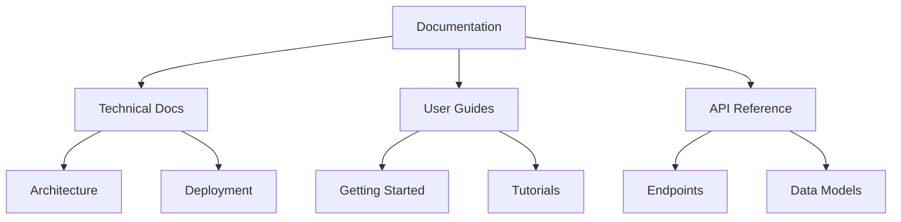

# V0.2.2 Documentation Technical Specifications

**Release Type**: Documentation Only  
**Date Completed**: 2025-05-26  
**Purpose**: This document outlines the technical specifications for the documentation updates in V0.2.2, which focused on improving documentation quality, structure, and maintainability without introducing new features.

## 1. Documentation Architecture

### 1.1 Documentation Structure


### 1.2 File Structure
```
docs/
├── technical/          # Technical documentation
│   ├── architecture/  # System architecture
│   ├── deployment/    # Deployment guides
│   └── api/           # API documentation
├── guides/            # User guides
│   ├── getting-started/
│   └── tutorials/
└── assets/            # Documentation assets
    ├── images/
    └── diagrams/
```

## 2. Documentation Implementation

### 2.1 Markdown Standards

#### Formatting Guidelines
```markdown
# H1 - Document Title
## H2 - Main Section
### H3 - Subsection

**Bold** for emphasis and UI elements
`code` for commands and file names

> Blockquotes for important notes

- Bullet points for lists
- Consistent indentation
```

### 2.2 Version Control

#### Branch Naming
- `docs/` prefix for documentation updates
- `fix/docs/` for documentation fixes
- `chore/docs/` for documentation maintenance

#### Commit Message Format
```
type(scope): brief description

Detailed explanation if needed

- Bullet points for changes
- One change per line

Fixes #123
```

### 2.3 Documentation Generation

#### Tools & Dependencies
- **Markdown Linter**: markdownlint
- **Link Checker**: markdown-link-check
- **Documentation Generator**: MkDocs
- **CI/CD**: GitHub Actions for automated testing

## 3. Documentation Standards

### 3.1 Content Guidelines
- Use active voice
- Be concise and clear
- Include examples where helpful
- Keep sentences short
- Use consistent terminology

### 3.2 Code Examples
- Include complete, runnable examples
- Add comments for clarity
- Show both input and expected output
- Include error handling

### 3.3 Accessibility
- Use descriptive link text
- Add alt text for images
- Ensure proper heading hierarchy
- Maintain color contrast
- Support keyboard navigation

## 4. Review Process

### 4.1 Documentation Review Checklist
- [ ] Technical accuracy verified
- [ ] Code examples tested
- [ ] Links validated
- [ ] Formatting consistent
- [ ] Spelling and grammar checked

### 4.2 Reviewers
- **Technical Review**: [Name]
- **Editorial Review**: [Name]
- **Final Approval**: [Name]

## 5. Future Improvements

### 5.1 Documentation
- [ ] Add search functionality
- [ ] Implement versioning
- [ ] Add dark mode
- [ ] Create PDF exports

### 5.2 Process
- [ ] Automate link checking
- [ ] Set up spell checking
- [ ] Add documentation metrics
- [ ] Schedule regular reviews

## 6. Performance Metrics

### 6.1 Documentation Performance
- **Build Time**: < 30 seconds
- **Page Load**: < 2 seconds
- **Search Index**: < 1MB
- **Accessibility**: > 95/100

### 6.2 Optimization
- Minified HTML/CSS/JS
- Compressed images
- Lazy loading for assets
- Caching headers

## 7. Maintenance

### 7.1 Update Process
1. Create feature branch
2. Make changes
3. Update CHANGELOG.md
4. Create pull request
5. Address review comments
6. Merge to main

### 7.2 Deprecation Policy
- Mark deprecated content with `> **Deprecated**`
- Include removal version
- Provide migration guides
- Keep for 2 major versions

## 8. Documentation Review Process

### 8.1 Review Checklist
- [ ] Technical accuracy verified
- [ ] Code examples tested
- [ ] Links validated
- [ ] Formatting consistent
- [ ] Accessibility standards met
- [ ] Browser compatibility verified

### 8.2 Reviewers
- **Technical Review**: [Name]
- **Editorial Review**: [Name]
- **Accessibility Review**: [Name]
- **Final Approval**: [Name]

## 9. Future Enhancements

### 9.1 Documentation Features
- [ ] Interactive API explorer
- [ ] Versioned documentation
- [ ] Dark mode
- [ ] Offline access
- [ ] Search functionality

### 9.2 Process Improvements
- [ ] Automated link checking
- [ ] Spell checking pipeline
- [ ] Documentation metrics dashboard
- [ ] Regular content audits

## 10. Documentation Standards

### 10.1 Writing Guidelines
- Use active voice and present tense
- Keep sentences short and clear
- Use consistent terminology
- Include examples where helpful
- Follow the style guide

### 10.2 Code Examples
- Include complete, runnable examples
- Add comments for clarity
- Show both input and expected output
- Include error handling

### 10.3 Accessibility
- Use descriptive link text
- Add alt text for images
- Ensure proper heading hierarchy
- Maintain color contrast
- Support keyboard navigation

## 11. Documentation Maintenance

### 11.1 Update Process
1. Create feature branch
2. Make changes
3. Update CHANGELOG.md
4. Create pull request
5. Address review comments
6. Merge to main

### 11.2 Deprecation Policy
- Mark deprecated content with `> **Deprecated**`
- Include removal version
- Provide migration guides
- Keep for 2 major versions

## 12. Performance Metrics

### 12.1 Documentation Performance
- **Build Time**: < 30 seconds
- **Page Load**: < 2 seconds
- **Search Index**: < 1MB
- **Accessibility**: > 95/100

### 12.2 Optimization
- Minified HTML/CSS/JS
- Compressed images
- Lazy loading for assets
- Caching headers

---
*Last Updated: 2025-05-26*
- `reveal.js`: ^4.2.0
- `lazysizes`: ^5.3.2
- `focus-visible`: ^5.3.0

### 5.2 Development Dependencies
- `webpack`: ^5.50.0
- `babel-loader`: ^8.2.2
- `postcss-preset-env`: ^7.0.0
- `eslint`: ^8.0.0
- `stylelint`: ^14.0.0

## 6. Testing Strategy

### 6.1 Unit Tests
- Test core utilities
- Test navigation logic
- Test state management

### 6.2 Integration Tests
- Test slide transitions
- Test keyboard navigation
- Test touch events

### 8.3 Documentation Testing
- [ ] Verify all internal links
- [ ] Test code examples
- [ ] Validate markdown syntax
- [ ] Check for broken external links
- [ ] Verify accessibility compliance

## 9. Documentation Review Process

### 9.1 Review Workflow
1. Author creates documentation update
2. Technical review by subject matter expert
3. Editorial review for clarity and style
4. Accessibility review
5. Final approval and merge

### 9.2 Review Criteria
- [ ] Accuracy of technical content
- [ ] Clarity and readability
- [ ] Consistent formatting
- [ ] Accessibility compliance
- [ ] Cross-browser compatibility

## 10. Documentation Maintenance

### 10.1 Versioning
- Follow semantic versioning (MAJOR.MINOR.PATCH)
- Update version in package.json and docs
- Maintain changelog for all versions

### 10.2 Deprecation Policy
- Mark deprecated features clearly
- Provide migration guides
- Maintain backward compatibility for at least 2 major versions

## 11. Performance Metrics

### 11.1 Documentation Performance
- **Build Time**: < 30 seconds
- **Page Load**: < 2 seconds (90th percentile)
- **Search Index**: < 1MB
- **Accessibility Score**: > 95/100 (Lighthouse)

### 11.2 Optimization
- Minified HTML/CSS/JS
- Compressed images and assets
- Lazy loading for non-critical resources
- Effective caching headers

## 12. Future Enhancements

### 12.1 Planned Features
- [ ] Interactive API explorer
- [ ] Versioned documentation
- [ ] Dark mode support
- [ ] Offline access
- [ ] Enhanced search functionality

### 12.2 Process Improvements
- [ ] Automated link checking
- [ ] Spell checking pipeline
- [ ] Documentation metrics dashboard
- [ ] Regular content audits

---
*Last Updated: 2025-05-26*
