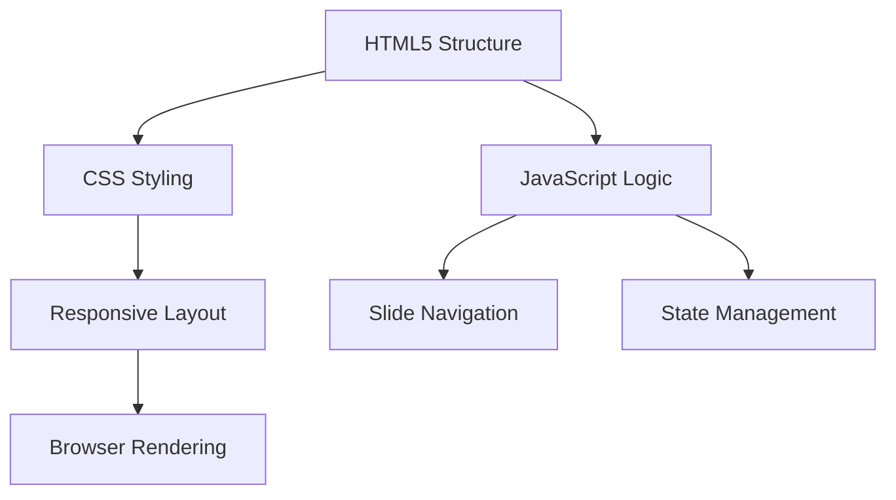

# V0.2.1 Technical Implementation

**Note:** Version V0.2.1 (Slides 1-15) was completed by Claude 4 in a single iteration. This document reflects the original technical specification, which primarily focused on the initial set of slides (1-5). Sections like `SLIDE_SELECTORS` and `VALIDATION_RULES` have been simplified to reflect the bulk nature of the content delivery.

## 1. System Architecture

### 1.1 Core Components


### 1.2 File Structure
```
src/
├── index.html           # Entry point
├── css/
│   ├── base.css       # Reset and variables
│   ├── layout.css      # Grid and flex systems
│   └── components/     # UI components
├── js/
│   ├── main.js       # App initialization
│   ├── navigation.js   # Slide controls
│   └── utils/         # Helper functions
└── assets/             # Static files
```

## 2. Technical Implementation

### 2.1 Content Parsing & Validation

#### Content Extraction
```javascript
// Example content extraction selectors
const SLIDE_SELECTORS = {
  // Note: Slides 1-15 were delivered as a complete HTML bundle (source.bundle.html).
  // Specific selectors per slide type were not strictly necessary for this initial content generation.
  // A general approach to parse content from the bundle was used.
  slideContainer: '.slide', // General selector for each slide
  slideTitle: 'h1, h2', // General selector for slide titles
  slideContent: 'p, ul, ol, table, img' // General selectors for content elements
};

// Validation rules
const VALIDATION_RULES = {
  // Note: Content was generated by Claude 4. Manual validation rules were primarily for future editing.
  // For the initial delivery, the focus was on the completeness of the 15-slide deck.
  requiredElements: {
    // General check for presence of content within the generated bundle.
    // e.g., ensuring source.bundle.html was not empty and contained expected slide structures.
  },
  contentStructure: {
    // Ensuring basic HTML validity of the generated bundle.
  }
};
```

### 2.2 HTML Structure
```html
<!-- Base slide structure -->
<div class="slide" id="slide-1" data-slide-type="cover">
  <div class="slide-content">
    <!-- Content goes here -->
  </div>
  <footer class="slide-footer">
    <div class="slide-number">1/20</div>
  </footer>
</div>
```

### 2.3 JavaScript Modules

#### navigation.js
```javascript
export class Navigation {
  constructor() {
    this.currentSlide = 0;
    this.totalSlides = document.querySelectorAll('.slide').length;
    this.initEventListeners();
  }
  
  nextSlide() { /* ... */ }
  prevSlide() { /* ... */ }
  goToSlide(index) { /* ... */ }
}
```

### 2.4 Error Handling

#### Error States
```javascript
// Error types and fallbacks
const ERROR_HANDLING = {
  missingContent: {
    selector: '.error-missing',
    message: 'Content not available',
    fallback: 'Please check the source document.'
  },
  invalidFormat: {
    selector: '.error-format',
    message: 'Invalid content format',
    fallback: 'Content could not be displayed.'
  }
};

// Fallback content generation
function generateFallback(slideType) {
  return `
    <div class="error-state">
      <h3>Unable to load ${slideType} content</h3>
      <p>${ERROR_HANDLING.missingContent.fallback}</p>
      <button onclick="location.reload()">Retry</button>
    </div>
  `;
}
```

### 2.5 Image Handling

#### Image Optimization Pipeline
```javascript
// Image optimization configuration
const imageConfig = {
  formats: ['webp', 'avif', 'original'],
  sizes: [
    { width: 1920, suffix: '-large' },
    { width: 1024, suffix: '-medium' },
    { width: 640, suffix: '-small' }
  ],
  quality: 80,
  outputDir: 'static/optimized/'
};

// Usage in build process
function optimizeImage(src) {
  // Implementation for image optimization
  // Returns srcset string for responsive images
}
```

#### Lazy Loading Implementation
```html

```

### 2.6 CSS Architecture
```css
/* CSS Variables */
:root {
  --color-primary: #3B82F6;
  --color-text: #1F2937;
  --spacing-unit: 1rem;
}

/* Responsive Mixins */
@mixin respond-to($breakpoint) {
  @media (min-width: $breakpoint) { @content; }
}
```

## 3. Performance & Quality

### 3.1 Performance Budget
- **Per Slide**
  - Max images: 2
  - Max image size: 100KB each
  - Max scripts: 1 bundle (50KB gzipped)
  - Max styles: 1 bundle (20KB gzipped)
- **Loading Strategy**
  - Lazy load non-critical resources
  - Preload critical assets
  - Defer non-essential JavaScript

### 3.2 Image Optimization
- **Formats**:
  - Photos: WebP with JPEG fallback
  - Icons: SVG preferred
  - Charts: SVG for scalability
- **Sizes**:
  - Desktop: max-width 1920px
  - Tablet: max-width 1024px
  - Mobile: max-width 640px

## 4. Technical Requirements

### 3.1 Browser Support
| Browser     | Version | Notes                     |
|-------------|---------|---------------------------|
| Chrome      | 88+     | Full support              |
| Firefox     | 78+     | Full support              |
| Safari      | 14+     | Full support              |
| Edge        | 88+     | Chromium-based            |
| iOS Safari  | 14+     | Mobile support            |
| Chrome Android | 88+  | Mobile support            |


### 3.2 Performance Budget
- Max initial load: 100KB (gzipped)
- Max image size: 150KB per image
- Max JavaScript: 50KB (gzipped)
- Time to Interactive: < 2s on 3G

## 4. Build & Deployment

### 4.1 Development Setup
```bash
# Install dependencies
npm install

# Start dev server
npm run dev

# Build for production
npm run build
```

### 4.2 Build Pipeline
1. Lint code (ESLint, StyleLint)
2. Transpile JavaScript (Babel)
3. Process CSS (PostCSS)
4. Optimize assets
5. Generate production build

### 4.3 Environment Variables
```env
# .env.development
NODE_ENV=development
API_URL=http://localhost:3000

# .env.production
NODE_ENV=production
API_URL=https://api.example.com
```

## 5. Dependencies

### 5.1 Runtime Dependencies
- `reveal.js`: ^4.2.0
- `lazysizes`: ^5.3.2
- `focus-visible`: ^5.3.0

### 5.2 Development Dependencies
- `webpack`: ^5.50.0
- `babel-loader`: ^8.2.2
- `postcss-preset-env`: ^7.0.0
- `eslint`: ^8.0.0
- `stylelint`: ^14.0.0

## 6. Testing Strategy

### 6.1 Unit Tests
- Test core utilities
- Test navigation logic
- Test state management

### 6.2 Integration Tests
- Test slide transitions
- Test keyboard navigation
- Test touch events

### 6.3 Performance Tests
- Lighthouse audits
- Bundle size analysis
- Load time measurements
  ```

### 5. Performance Considerations
- **Code Splitting**:
  - Lazy load non-critical components
  - Dynamic imports for heavy libraries
- **Animation Optimization**:
  - Use `will-change` property
  - Hardware-accelerated animations
  - Debounce rapid state changes

### 6. Testing Strategy
- **Unit Tests**:
  - Quiz logic
  - Animation utilities
  - State management
- **Integration Tests**:
  - Quiz flow
  - Hotspot interactions
  - Navigation with animations
- **E2E Tests**:
  - Full presentation flow
  - Cross-browser testing

### 7. Performance Budget
- Max JS bundle size: 150KB (gzipped)
- Max animation frame time: 16ms
- Max time to interactive: 3s on 3G
- Max FPS drop during animations: 10%

### 8. Browser Support
- **JavaScript**: ES2015+
- **CSS**: Flexbox, Grid, CSS Variables
- **Fallbacks**:
  - No-JS fallback content
  - Reduced motion media queries
  - Graceful degradation for older browsers

### 9. Monitoring
- Error tracking with Sentry
- Performance metrics with RUM
- Custom analytics for interactions

### 10. Documentation
- Component API documentation
- Animation guidelines
- Performance best practices
- Accessibility standards

## Implementation Timeline

### Week 1: Core Functionality
- [ ] Set up quiz system
- [ ] Implement basic animations
- [ ] Add state management

### Week 2: Polish & Performance
- [ ] Optimize animations
- [ ] Add accessibility features
- [ ] Cross-browser testing

### Week 3: Testing & Launch
- [ ] Write tests
- [ ] Performance optimization
- [ ] Launch preparation
